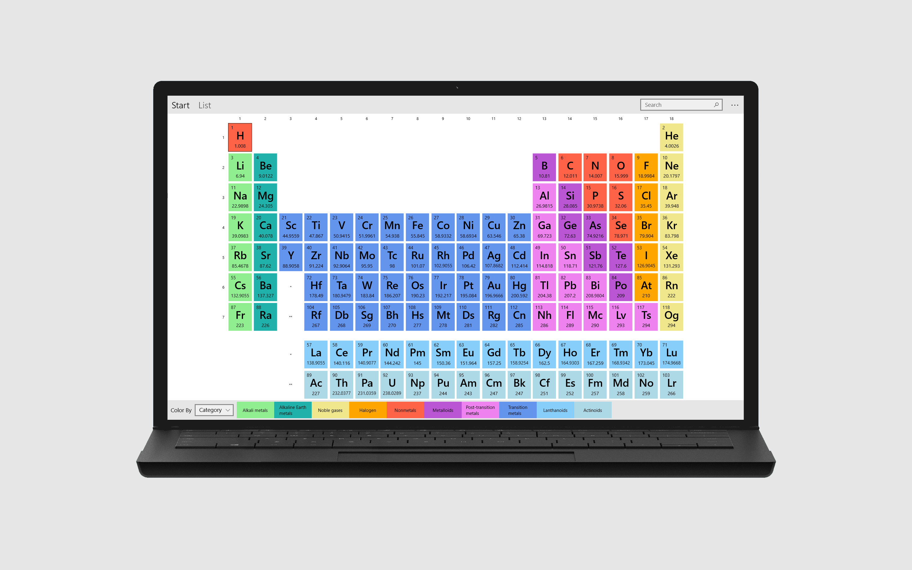

# Periodica

> A modern Periodic Table of Elements app for Windows 10 with comprehensive information on all 118 elements

Periodica is a modern Periodic Table of Elements App for Windows 10.
Get comprehensive information about all chemical elements with this app.
Click on an element on the overview page to get detailed information about an element's properties.
Use the list view to sort and filter elements and get a quick overview of important properties.
Or change the coloring mode to color the periodic table by category, block or state. 

## Features

- Colorful designed view of the periodic table

- Detailed properties for all chemical elements

- Sort and filter elements by properties in a list

- Switch the coloring of the elements between many different designs

- Images, electron shell model and links for every element

- Modern and simple UI

- No internet connection required

- Easily search for elements

## Setup and Usage

Periodica requires Windows 10 or newer. Download it from the [Microsoft Store](https://www.microsoft.com/store/apps/9PB2TD7P6DT3).

## Feedback and Support

_Please leave a review in the [Microsoft Store](https://www.microsoft.com/store/apps/9PB2TD7P6DT3), on [AlternativeTo](https://alternativeto.net/software/periodica--periodic-table/) and recommend Periodica if you like it. Thank you!_

Places to get help:

* Open an issue on [GitHub](https://github.com/bluegrams/periodica/issues) (Bugs, feature requests etc.)

## Contribute

You are very welcome to support the development of this app by reporting bugs, adding fixes, translating or suggesting new features.
The easiest way to contribute is to open [pull request on GitHub](https://github.com/bluegrams/periodica/pulls).

## License

This software is published under [BSD-3-Clause license](https://github.com/Bluegrams/Periodica/blob/master/LICENSE.txt) by Bluegrams.

## Credits

- Element data is provided in https://github.com/Bluegrams/periodic-table-data
- Credits for element images are given in-app

